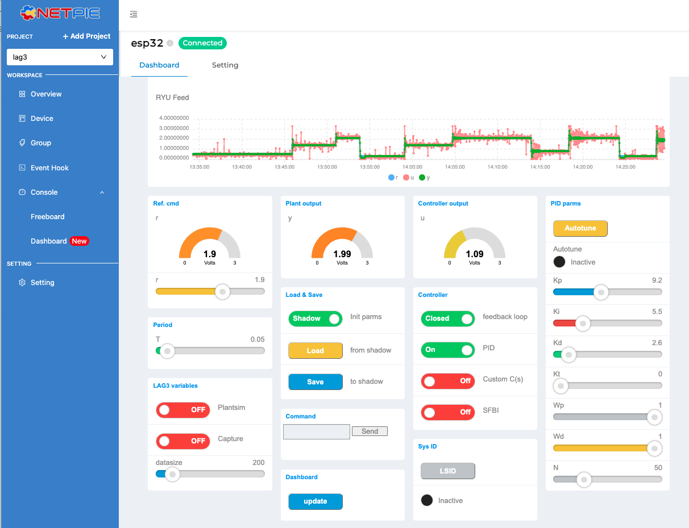
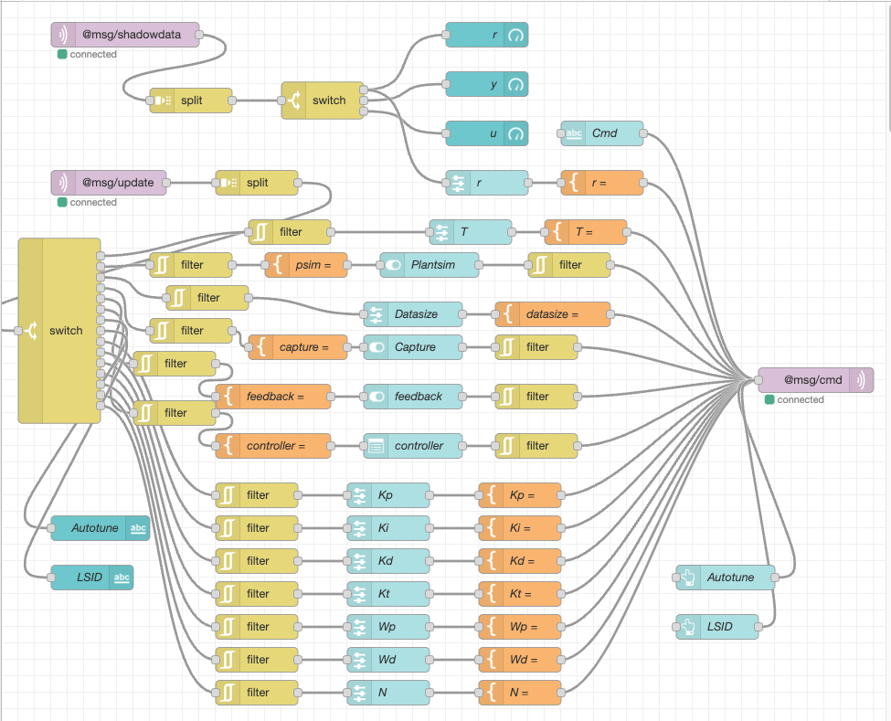

# 01205479 IoT for Electrical Engineering

## Academic year 2024

<table>
<tr>
<td></td>
<td></td>
<td></td>
</tr>
  
</table>

The materials in this repo are from my course above, conducted in semester 1 of academic year 2024 
(International Undergrauate Program).

### Lecture 0 : Course introduction

<ul>
<li /><a href="/lecture0/eeiot24_lect0.pdf">Slides</a>
</ul>

### Lecture 1 : Basic circuit analysis and simulation
<ul>
<li /><a href="/lecture1/eeiot24_lect01.pdf">Slides</a>
<li /><a href="/lecture1/exercises/">Exercises</a>
<li /><a href="https://drive.google.com/file/d/1_NplX2Tpb25E9cA2rmC1_r46rkyWKwa2/view?usp=drive_link">video</a>
</ul>

### Lecture 2 : AC circuits & time varying signals
<ul>
<li /><a href="/lecture2/eeiot24_lect2.pdf">Slides</a>
<li /><a href="/lecture2/notebooks/">Exercises</a>
<li /><a href="https://drive.google.com/file/d/16CDpHYhhA1cyoeB0jJyDD_Ny1SGLyTg3/view?usp=drive_link">video</a>
</ul>

### Lecture 3 : Op-amps and signal conditioning
<ul>
<li /><a href="/lecture3/eeiot24_lecture3.pdf">Slides</a>
<li /><a href="/lecture3/lect3_supplement_lag3.pdf">Supplement slides (LAG3 board design)</a>
<li /><a href="/lecture3/notebook/">Exercises</a>
<li /><a href="/lecture3/easyeda/">EasyEDA schematics</a>
<li /><a href="https://drive.google.com/file/d/1Rt77tdn-j_9e3hVSf08uHtTYY40xgsRZ/view?usp=drive_link">video</a>
</ul>

### Lecture 4 : Introduction to Wokwi simulation

<ul>
<li /><a href="/lecture4/eeiot24_lect4.pdf">Slides</a>
<li /><a href="/lecture4/c_code.ipynb">C-code</a>  
<li /><a href="https://drive.google.com/file/d/18XuxVGtWWTFg9-1dIPK9HtohebcriscX/view?usp=drive_link">video</a>
</ul>

### Lecture 5

### Lecture 6

### Lecture 7

### Lecture 8

### Lecture 9

